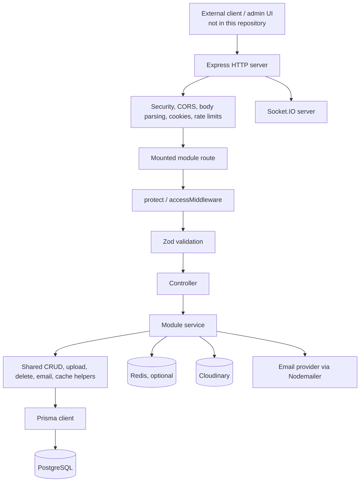
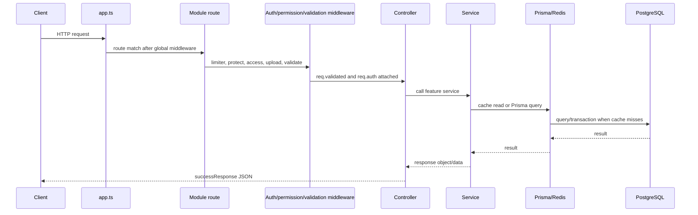
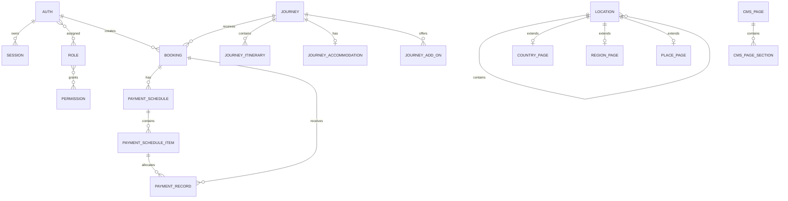
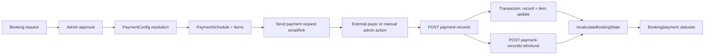

# CODEBASE OVERVIEW

> **Repository state documented:** 2026-09-05
>
> This document describes the implementation currently present in this repository. It is intentionally evidence-based: where a requested capability is not implemented or cannot be established from the checked-in code, it is marked **Unknown / Not found in current codebase**.

## 1. Project Summary

This repository contains the **MIRA / POLI Server** backend for a travel-content and journey-booking platform. It is a TypeScript Express API backed by PostgreSQL through Prisma, with Redis support, Cloudinary media storage, email delivery, JWT authentication, role/permission authorization, CMS content, journeys, hierarchical locations, bookings, and payment schedule/record management.

The repository is **backend-only**. No frontend application, frontend API client, frontend routing, frontend context, or frontend component tree is present in the current workspace. The API is designed to serve a separate client, including an administrative/content-management client, but that client is not part of this repository.

### Main users and use cases

- Unauthenticated visitors can read public content and journey data.
- Registered users can verify an account, log in, manage their profile, and submit a booking request for a published journey.
- Authenticated staff can manage CMS pages, locations, journeys, booking decisions, payment schedules, payment records, roles, permissions, and uploads, subject to permissions.
- Administrators can approve or reject booking requests, generate or override payment schedules, record manual/PSP payment outcomes, and record refunds.

### Major implemented capabilities

- JWT access and refresh token authentication with cookie and bearer-token support.
- Email verification and password reset flows.
- Many-to-many role and permission authorization.
- Public and protected CRUD-style APIs for content and travel domain objects.
- CMS pages and ordered page sections using JSON metadata/data fields.
- Journey, itinerary, accommodation, add-on, and location management.
- Booking lifecycle with approval, rejection, cancellation, total revision, and payment-state synchronization.
- Configurable payment schedules, schedule items, payment records, and refunds.
- Multer memory uploads to Cloudinary for image, video, audio, and document types.
- Redis-backed read caching and rate-limit storage when Redis is available.
- Swagger UI/OpenAPI generation from the route registry and Zod metadata.
- HTTP and Socket.IO servers with JWT validation for sockets.
- Development tests using Jest and Supertest.

### Important scope boundaries

- A real card/payment gateway integration, webhook endpoint, PSP verification flow, and automatic settlement are **Unknown / Not found in current codebase**. Payment records can store a PSP reference, but the implementation currently records payments administratively or from an external caller.
- A frontend application is **Unknown / Not found in current codebase**.
- RabbitMQ connection code is commented out; no active message broker integration is present.
- Audit logs are printed to the console; there is no audit-log Prisma model or database persistence in the current schema.
- Nginx, SSL, DNS, and CI/CD configuration are **Unknown / Not found in current codebase**.

## 2. Technology Stack

| Area                     | Technology                                    | Current use                                                  |
| ------------------------ | --------------------------------------------- | ------------------------------------------------------------ |
| Runtime                  | Node.js 22 in Docker                          | Server runtime; Docker images use `node:22-alpine`           |
| Language                 | TypeScript                                    | Application source and Prisma integration                    |
| HTTP framework           | Express 5                                     | REST API and middleware pipeline                             |
| Database                 | PostgreSQL                                    | Prisma datasource in `prisma/schema/schema.prisma`           |
| ORM                      | Prisma 6                                      | Generated client, models, transactions, migrations/config    |
| Authentication           | `jsonwebtoken`, `bcryptjs`, cookies           | JWT access/refresh/invite tokens and password hashing        |
| Validation               | Zod                                           | Request schemas and OpenAPI metadata                         |
| Cache / rate-limit store | Redis via `ioredis` and `rate-limit-redis`    | Read cache and optional distributed rate limiting            |
| File handling            | Multer memory storage                         | Multipart parsing and file type/size checks                  |
| Media storage            | Cloudinary                                    | Upload and deletion of externally stored media               |
| Email                    | Nodemailer Gmail transport                    | Verification, reset, booking, payment and notification email |
| API documentation        | Swagger UI, custom OpenAPI builder            | `/api/docs` and `/api/swagger.json`                          |
| Realtime                 | Socket.IO                                     | Authenticated sockets and ticket-room join event             |
| Security middleware      | Helmet, CORS, HPP, XSS sanitizer, compression | HTTP hardening and request processing                        |
| Testing                  | Jest, Supertest                               | Current tests under `tests/`                                 |
| Process manager          | PM2 config                                    | Production process configuration in `ecosystem.config.cjs`   |
| Containers               | Docker / Docker Compose                       | Build image and development compose service                  |

Declared dependencies are authoritative in `package.json`. The old root `README.md` describes a different/older module layout in places; follow source and schema files over that README.

## 3. High-Level Architecture



The dominant application pattern is:

```text
route
  -> limiter / protect / accessMiddleware / uploadFile / validate
  -> controller
  -> service
  -> shared helper and/or Prisma transaction
  -> successResponse or service result
  -> globalErrorHandler on failure
```

### Runtime startup

1. `index.ts` imports `httpServer`, `io`, and `PORT` from `app.ts`.
2. Prisma connects and executes `SELECT 1`.
3. `redisManager.connect()` initializes Redis if `REDIS_HOST` and `REDIS_PORT` exist. Missing Redis configuration does not stop startup.
4. The HTTP server listens on `127.0.0.1` at the configured port.
5. `SIGINT`, `SIGTERM`, `SIGHUP`, uncaught exceptions, and unhandled rejections initiate graceful shutdown.
6. Shutdown closes HTTP, Socket.IO, Prisma, and Redis connections, with a 15-second timeout.

## 4. Repository / Folder Structure

```text
.
├── app.ts                         Express app, HTTP server, Socket.IO, global middleware
├── bootstraps.ts                  API route registration
├── index.ts                       Startup and graceful shutdown
├── package.json                   Scripts and dependencies
├── tsconfig.json                  TypeScript compiler configuration
├── Dockerfile                     Multi-stage production image
├── docker-compose.yml             Development container configuration
├── ecosystem.config.cjs           PM2 process configuration
├── prisma/
│   ├── prisma.config.js           Prisma CLI datasource/schema configuration
│   └── schema/                    Modular Prisma schema files and migrations
├── src/
│   ├── config/                    Environment, Prisma, Redis, Cloudinary
│   ├── docs/swagger/               OpenAPI builder, Swagger setup and route registry
│   ├── logger/                    Request, response, error, audit and provider logs
│   ├── middlewares/               Security, auth, authorization, validation, uploads, limits
│   ├── modules/                   Feature routes, controllers, validators and services
│   ├── shared/                    Reusable CRUD/cache/upload/delete/email helpers
│   ├── types/                     Express and global TypeScript declarations
│   └── utils/                     Errors, auth helpers, response, parsing and utility functions
├── public/                        Static files served by Express
├── markdown/                      Project notes and API/domain documentation
├── postman/                       Postman collection and sample data
└── tests/                         Jest/Supertest integration-style tests and test DB helpers
```

### Important module folders

| Folder                             | Responsibility                                                               |
| ---------------------------------- | ---------------------------------------------------------------------------- |
| `src/modules/auth`                 | Registration, verification, login, refresh, logout, profile, passwords       |
| `src/modules/settings/roles`       | Role CRUD and role permissions                                               |
| `src/modules/settings/permissions` | Permission CRUD                                                              |
| `src/modules/fileUpload`           | Generic authenticated Cloudinary upload endpoint                             |
| `src/modules/cms`                  | `CmsPage` and `CmsPageSection` management                                    |
| `src/modules/location`             | Hierarchical location CRUD                                                   |
| `src/modules/country`              | Country page and country page sections                                       |
| `src/modules/region`               | Region page and region page sections                                         |
| `src/modules/place`                | Place page and place page sections                                           |
| `src/modules/journey`              | Journey, itinerary, accommodation and add-on resources                       |
| `src/modules/booking`              | Booking, payment schedule, payment record, payment config and payment engine |

Most feature folders follow the local pattern of `*.routes.ts`, `*.controller.ts`, `*.service.ts`, and `*.validator.ts`. Some nested resource names use capitalized directory names such as `Journey/` while file names remain lower camel case.

## 5. Backend Architecture

### Entry points and application setup

- `app.ts` creates the Express app and HTTP server, serves `public`, configures security middleware, creates Socket.IO, exposes health/welcome endpoints, mounts bootstrapped routes, mounts Swagger, then installs not-found and global error middleware.
- `bootstraps.ts` is the single route registration surface.
- `index.ts` owns connection startup, listen, process-level error handling, and graceful shutdown.
- `src/config/prisma.ts` creates a singleton Prisma client and registers Prisma logging.
- `src/config/index.ts` loads environment variables through `dotenv-flow` outside production and exposes defaults.

### Middleware order in `app.ts`

The effective application order is:

1. `requestProfilerMiddleware`
2. `express.static("public")`
3. Helmet security headers
4. HPP and XSS sanitizer
5. CORS with credentials
6. Socket.IO creation and socket authentication middleware
7. Compression
8. JSON and URL-encoded body parsers, each limited to 2 MB
9. Cookie parser
10. `globalLimiter`
11. Health and welcome endpoints
12. Request and response loggers
13. `bootstraps(app)` route registration
14. Swagger setup
15. `notFoundMiddleware`
16. `globalErrorHandler`

Route-level middleware is normally `protect`, a limiter, optional `accessMiddleware`, optional `uploadFile`, then `validate`, then the controller. CSRF support exists in `src/middlewares/csrf.middleware.ts`, but the current auth routes leave the CSRF calls commented out, so CSRF is not active on those routes.

### Controllers and services

Controllers are thin adapters. They read `req.validated`, `req.auth`, cookies or files, call services, and return either `successResponse` or a service-provided response object. `catchAsync` forwards rejected promises to Express error handling.

Services own business rules and Prisma queries. Complex state-changing operations use `prisma.$transaction`, especially booking approval, schedule override, payment recording, refunds, cancellation, and schedule-item waivers.

### Response format

Successful responses generated by `src/utils/success.response.ts` have this shape:

```json
{
  "success": true,
  "message": "...",
  "code": 200,
  "meta": null,
  "data": {}
}
```

Paginated `getRecords` responses use `meta.total`, `meta.page`, `meta.limit`, and `meta.totalPages`. Errors use `{ success: false, status: "fail" | "error", message, data: null, code }`.

## 6. Frontend Architecture

**Unknown / Not found in current codebase.** There is no `frontend/`, `admin/`, React/Vue/Next/Vite application, API client, UI component tree, browser state store, frontend auth context, draft context, or frontend preview implementation in the current repository.

The backend does expose APIs that a separate frontend can consume. The intended consumer contract must be inferred from route validators, response helpers, Swagger/OpenAPI output, and the Postman collections, not from checked-in frontend code.

## 7. Module-by-Module Documentation

### 7.1 Auth module

**Purpose:** account creation, email verification, login/session lifecycle, profile, password changes and resets.

**Main files:** `src/modules/auth/auth.routes.ts`, `auth.controller.ts`, `auth.service.ts`, `auth.validator.ts`, `src/utils/auth.helper.ts`, `src/middlewares/auth.middleware.ts`.

**Routes:**

| Method   | Path                                                | Protection                                      | Behavior                                                                                                                       |
| -------- | --------------------------------------------------- | ----------------------------------------------- | ------------------------------------------------------------------------------------------------------------------------------ |
| POST     | `/api/v1/auth/register`                             | Public + limiter + upload + Zod                 | Direct account registration; email verification is required                                                                    |
| POST     | `/api/v1/auth/register/instructorInfo/:token`       | Public                                          | Contractor role wrapper around registration; token path exists but token registration branch is currently commented in service |
| POST     | `/api/v1/auth/register/userInfo/:token`             | Public                                          | Driver role wrapper; same token-registration limitation                                                                        |
| POST/GET | `/api/v1/auth/verify-email`, `/verify-email/:token` | Public + OTP limiter                            | Verify by OTP or invite/email token                                                                                            |
| POST     | `/api/v1/auth/resend-verification`                  | Public + OTP limiter                            | Reissue verification code                                                                                                      |
| POST     | `/api/v1/auth/login`                                | Login limiter + placeholder checks + validation | Authenticate and set access/refresh cookies; response also includes tokens                                                     |
| POST     | `/api/v1/auth/refresh-token`                        | Public                                          | Reads refresh cookie or body token and rotates/returns tokens                                                                  |
| POST     | `/api/v1/auth/logout`                               | `protect`                                       | Logout current session or all devices                                                                                          |
| POST     | `/api/v1/auth/forgot-password`                      | OTP limiter                                     | Send reset OTP/link                                                                                                            |
| GET/POST | `/api/v1/auth/verify-forgot-password`               | OTP limiter                                     | Verify reset OTP/token                                                                                                         |
| GET/POST | `/api/v1/auth/reset-password`                       | Public                                          | Reset password using reset token                                                                                               |
| GET      | `/api/v1/auth/me`                                   | `protect`                                       | Return authenticated request user                                                                                              |
| GET      | `/api/v1/auth/user-info`                            | `protect`                                       | Query current user profile/roles                                                                                               |
| POST     | `/api/v1/auth/change-password`                      | `protect`                                       | Change password                                                                                                                |
| POST     | `/api/v1/auth/me`                                   | `protect` + image upload                        | Update profile and media                                                                                                       |

**Current implementation notes:** `createAccountService` supports direct registration based on `DIRECT_REGISTER`; the token-registration code is commented out. `protect` verifies the access token and attaches decoded token data, but the full database user lookup and account status checks are commented out. The `checkBlockedIP`, `checkBruteForce`, and `checkDeviceTrust` middleware functions currently call `next()` and contain TODOs. Do not document those as active security enforcement.

### 7.2 Roles and permissions

**Routes:** `/api/v1/roles` and `/api/v1/permissions`. They use the same route/controller/service/validator pattern and are intended for protected permission-managed administration. The exact route methods should be checked in the corresponding `*.routes.ts` files before client integration.

**Authorization model:** `Auth` has many-to-many `Role`; `Role` has many-to-many `Permission`. A permission has `action` (`CREATE`, `READ`, `UPDATE`, `DELETE`), optional `resource`, and `scope` (`OWN`, `ANY`, `OTHER`). `accessMiddleware(modelName)` maps HTTP method to an action, finds matching permissions in `req.auth.roles[*].permissions`, and stores matches in `req.matchedPermissions`.

**Caveat:** `accessMiddleware` requires role/permission data on `req.auth`, while the current `protect` implementation attaches decoded token data. Whether login tokens always carry the required role/permission structure must be verified in `auth.service.ts` and token creation helpers before changing authorization behavior.

### 7.3 CMS module

**Routes:** `/api/v1/cms-pages` and `/api/v1/cms-pages-sections`.

- Public GET routes read CMS content.
- POST and DELETE routes require authentication and `accessMiddleware`.
- Multipart upload handling is available on page management routes.
- `CmsPage` owns ordered `CmsPageSection` records.
- Both models have `metadata` and `data` JSON fields and nullable `deletedAt` fields for soft-delete-oriented filtering.
- `CmsPage.slug` is globally unique; section slug is unique within a page.

There is no frontend draft/preview context in this repository. Draft/published CMS behavior beyond the stored data and `deletedAt` fields is **Unknown / Not found in current codebase**.

### 7.4 Location, country, region and place modules

**Routes:**

- `/api/v1/locations`
- `/api/v1/country-pages`, `/api/v1/country-pages-sections`
- `/api/v1/region-pages`, `/api/v1/region-pages-sections`
- `/api/v1/place-pages`, `/api/v1/place-pages-sections`

`Location` is a self-referencing hierarchy through `parentId`, with `LocationType` values from `CONTINENT` through `LANDMARK`. Country, region, and place pages are one-to-one extensions of a location and each has ordered child sections. Journey itinerary, accommodation, and add-on records may optionally reference a location.

### 7.5 Journey module

**Routes:** `/api/v1/journeys`, `/api/v1/journey-itinerary`, `/api/v1/journey-accommodations`, `/api/v1/journey-addons`.

`Journey` stores a unique slug, title, price/currency, day range, image arrays, highlights, included/not-included arrays, filter enums, `DRAFT`/`PUBLISHED`/`ARCHIVED` status, featured flag, and JSON metadata/data. Child resources are itinerary days, one optional accommodation record, and add-ons.

Public journey GET routes use validation and public rate limiting. Management routes require `protect`, permission checks, upload middleware where applicable, and validation. A booking can only be created for a journey whose status is `PUBLISHED`.

### 7.6 Booking module

**Routes:** `/api/v1/bookings`.

- `GET /` protected and permission-scoped; supports filters for status, journey, traveler, booking number, dates, search and due items.
- `POST /` protected; creates a request and takes no payment.
- `PATCH /:id` protected and permission-scoped; edits only pre-approval.
- `POST /:id/approve` protected and permission-scoped; snapshots total and creates an active payment schedule.
- `POST /:id/reject` protected and permission-scoped; rejects pre-payment request and sends email.
- `POST /:id/cancel` protected and permission-scoped; cancels booking and active schedules.
- `POST /:id/revise-total` protected and permission-scoped; recalculates unpaid schedule items after a total change.
- `DELETE /` protected and permission-scoped; deletes only bookings with no recorded payment, up to the shared delete limit.

The booking service validates that selected add-ons belong to the selected journey, generates a human-readable booking number, records consent timestamps, and writes audit output. Booking creation requires an authenticated `createdBy` user even though the form is otherwise a customer-facing request.

### 7.7 Payment schedule module

**Routes:** `/api/v1/payment-schedules`.

- List schedules and filter by id, booking, or status.
- `GET /due-overview` returns overdue/upcoming schedule items.
- `POST /override` replaces the active schedule with an installment plan after validation.
- `POST /:itemId/waive` waives an unpaid item and recalculates the total/state.
- `POST /send-request` marks the next/selected item due and sends an email payment link.

The payment link is constructed as `${OTP_BASE_URL or first CORS origin}/pay/{bookingId}/{scheduleItemId}`. The endpoint is an email/link generation action; no gateway checkout or webhook is implemented here.

### 7.8 Payment record module

**Routes:** `/api/v1/payment-records`.

- `GET /` lists records.
- `POST /` appends a manual or PSP-outcome record and updates the target schedule item and booking state in a transaction.
- `POST /:id/refund` records full/partial refund amounts; records are not deleted.

`pspTransactionRef` is stored as data, but no PSP client, signature validation, webhook route, or external refund API call is present.

### 7.9 File upload module

**Route:** `POST /api/v1/file-upload`.

The route requires authentication and accepts up to ten files across image/video/file fields. `multer` stores files in memory. `fileUpload.service.ts` deletes requested Cloudinary URLs, uploads new files, and groups returned secure URLs by original field name. Feature modules also use `uploadFile()` directly for media fields.

### 7.10 Settings modules

Role and permission settings are modeled as shared authorization resources rather than per-feature roles embedded in each service. New protected modules should use `accessMiddleware("ModelName")` and define corresponding permission resources rather than inventing a parallel authorization mechanism.

## 8. Request Lifecycle



Errors from any async controller/service flow reach `globalErrorHandler` through `catchAsync` or explicit `next(err)`.

## 9. Database Architecture

### Schema organization

The Prisma datasource is PostgreSQL and the schema entry is `prisma/schema/schema.prisma`, configured by `prisma/prisma.config.js`. The schema entry contains the generator/datasource; model definitions are split into sibling `.prisma` files under `prisma/schema/`.

### Core model groups

| Group         | Models / enums                                                                                          | Important relationships                                                       |
| ------------- | ------------------------------------------------------------------------------------------------------- | ----------------------------------------------------------------------------- |
| Identity      | `Auth`, `UserPersonalInfo`, `UserSettings`, `Session`, `Status`                                         | Auth owns sessions, profile/settings, roles, bookings                         |
| Authorization | `Role`, `Permission`, `Action`, `Scope`                                                                 | Role/Auth and Role/Permission are many-to-many                                |
| Location      | `Location`, `LocationType`                                                                              | Self-referencing parent/children hierarchy                                    |
| Content       | `CmsPage`, `CmsPageSection`                                                                             | Page has ordered sections; cascade delete from page                           |
| Geo content   | `CountryPage`, `CountryPageSection`, `RegionPage`, `RegionPageSection`, `PlacePage`, `PlacePageSection` | Each page is one-to-one with a location and has sections                      |
| Journey       | `Journey`, `JourneyItinerary`, `JourneyAccommodation`, `JourneyAddOn`                                   | Journey has itinerary/add-ons, optional accommodation, bookings               |
| Booking       | `Booking`, `BookingStatus`, `TravelerType`                                                              | Booking belongs to Auth and Journey                                           |
| Payment       | `PaymentSchedule`, `PaymentScheduleItem`, `PaymentRecord`, `PaymentConfig` and payment enums            | Booking has schedules/records; schedule has items; records can target an item |

### Relationship overview



### Constraints and deletion

- IDs are generally `cuid()`, with `uuid()` used by `UserSettings`.
- Unique values include email, role name, location slug, journey slug, booking number, CMS page slug, one page per location, and section slug within a parent.
- Indexes support status, parent, date, booking, payment, due date, and common relation lookups.
- Auth-owned profile/settings/session records cascade on Auth deletion.
- CMS page sections, journey child content, and several location-page children use cascade behavior.
- `Booking` does not expose a general soft-delete field; deletion is guarded by payment state in the service.
- CMS models have `deletedAt`, but all soft-delete semantics must be checked in their services before relying on them.
- Monetary values use Prisma `Decimal` with two decimal places. Service logic converts to numbers and rounds with `round2`.
- JSON fields (`metadata`, `data`, `geoData`) are flexible extension points and therefore require validator/service review before changing their shape.

## 10. Prisma / ORM Architecture

- Schema entry: `prisma/schema/schema.prisma`.
- Config: `prisma/prisma.config.js`.
- Client singleton: `src/config/prisma.ts`.
- Prisma logging is event-based in development and warning/error based otherwise.
- Services use direct `prisma.<model>` queries, `findMany`/`count` pairs for pagination, `include` for domain response graphs, and `$transaction` for coupled state changes.
- `src/shared/getRecords.service.ts` provides common filtering, pagination, ordering, optional owner scopes, Redis caching, and audit logging.
- `src/shared/delete.service.ts` provides bounded bulk deletion, optional external URL deletion, transaction-safe database deletion, cache invalidation, and audit output.
- Prisma migrations are under `prisma/schema/migrations/`. The repository file inventory did not expose migration SQL files through the workspace search; inspect the directory directly before claiming a migration count or specific migration history.

## 11. Authentication & Authorization

### Authentication flow

```text
Register
  -> bcrypt password hash
  -> Auth row + role + profile/settings + hashed OTP/email token
  -> verification email
  -> verify OTP or token

Login
  -> password comparison and token creation
  -> accessToken + refreshToken cookies
  -> response also returns tokens in data

Protected request
  -> access token from cookie or Authorization: Bearer
  -> JWT verification
  -> req.auth attached
  -> optional role/permission middleware
```

`auth.helper.ts` is the token/password helper boundary. Config supports separate access, invite, and refresh token secrets and expiry values. The current route uses cookies and also accepts bearer access tokens in middleware.

### Refresh/session behavior

`Session` stores refresh-token hash, token family, device/user-agent/IP/fingerprint metadata, revocation state, expiry, and last use. The exact rotation/reuse-detection behavior is implemented in the auth service/helper and should be preserved when changing refresh logic.

### Authorization behavior

`accessMiddleware(modelName)` derives CREATE/READ/UPDATE/DELETE from the request method and presence of an id. It matches resource/action permissions attached to the authenticated roles. `getRecords` and `deleteRecordsSafely` additionally interpret permission scopes when an owner field is supplied.

### Security caveats

- CSRF middleware is present but calls are commented out in auth routes.
- Blocked-IP, brute-force and device-trust checks are placeholders that currently pass through.
- The full user lookup and status/deleted checks in `protect` are commented out; the middleware currently relies on decoded token data.
- Never assume role/status revocation is immediately enforced unless token creation and `protect` are updated together.

## 12. Validation System

Validation library: **Zod**.

Validators live beside each module, for example `auth.validator.ts`, `booking.validator.ts`, and `paymentRecord.validator.ts`. The `validate(schema)` middleware:

1. Detects multipart content type for Swagger metadata.
2. Copies and boolean-converts params, query, and body.
3. Parses the combined object with the schema.
4. Stores parsed values as `req.validated = { params, query, body }`.
5. Forwards `ZodError` to the global error handler.

Controllers and services should consume `req.validated`, not raw request data, except for explicitly handled cookies/files. Multipart requests are parsed by Multer before Zod validation.

## 13. Error Handling

`src/utils/api.error.ts` is the custom application error. `src/middlewares/error.middleware.ts` maps:

- `ApiError` to its status/message.
- `ZodError` to HTTP 400 with field-oriented messages.
- Prisma known errors such as unique conflicts (`P2002`), missing records (`P2025`), and relation violations (`P2003`/`P2014`) to friendly statuses/messages.
- Prisma initialization/Rust panic errors to HTTP 500.
- Invalid JSON to HTTP 400.
- Unknown `Error` instances to their message with a 500 default.

Every error is logged with method, path, status, stack, and original error. The public error response is:

```json
{
  "success": false,
  "status": "fail",
  "message": "...",
  "data": null,
  "code": 400
}
```

## 14. API Documentation

Swagger is mounted at `GET /api/docs`; the generated JSON is available at `GET /api/swagger.json`. `src/docs/swagger/swagger.ts` calls `buildOpenAPI()`, while route registration uses `src/docs/swagger/routeRegistry.ts` and Zod/upload metadata is exposed by middleware for documentation generation.

### Major API surface

| Base path                        | Module                 | Typical access               |
| -------------------------------- | ---------------------- | ---------------------------- |
| `/api/v1/auth`                   | Auth/profile/password  | Mixed public/protected       |
| `/api/v1/roles`                  | Roles                  | Protected/permission-managed |
| `/api/v1/permissions`            | Permissions            | Protected/permission-managed |
| `/api/v1/file-upload`            | Generic media upload   | Protected                    |
| `/api/v1/cms-pages`              | CMS pages              | Public GET, protected writes |
| `/api/v1/cms-pages-sections`     | CMS sections           | Mixed, see route file        |
| `/api/v1/locations`              | Location hierarchy     | Mixed, see route file        |
| `/api/v1/country-pages`          | Country pages          | Mixed                        |
| `/api/v1/country-pages-sections` | Country sections       | Mixed                        |
| `/api/v1/region-pages`           | Region pages           | Mixed                        |
| `/api/v1/region-pages-sections`  | Region sections        | Mixed                        |
| `/api/v1/place-pages`            | Place pages            | Mixed                        |
| `/api/v1/place-pages-sections`   | Place sections         | Mixed                        |
| `/api/v1/journeys`               | Journeys               | Public GET, protected writes |
| `/api/v1/journey-itinerary`      | Itinerary              | Mixed                        |
| `/api/v1/journey-accommodations` | Accommodation          | Mixed                        |
| `/api/v1/journey-addons`         | Add-ons                | Mixed                        |
| `/api/v1/bookings`               | Booking lifecycle      | Protected                    |
| `/api/v1/payment-schedules`      | Schedule management    | Protected                    |
| `/api/v1/payment-records`        | Payment/refund records | Protected                    |
| `/api/v1/payment-config`         | Payment configuration  | Protected                    |

Operational endpoints are `/api/v1/health` and `/api/v1/`; welcome output points clients to `/api/docs`.

## 15. Data Flow

### Generic CRUD/read flow

```text
Client request
  -> public limiter or global limiter
  -> protect when needed
  -> accessMiddleware(model) when needed
  -> uploadFile when multipart
  -> Zod validator
  -> controller
  -> service
  -> getRecords or direct Prisma query
  -> Redis read cache, if ready
  -> PostgreSQL on cache miss
  -> audit logger
  -> response JSON
```

Writes generally use direct service logic and may invalidate cache through `deleteRecordsSafely`; the repository should be checked before assuming every write invalidates every related read cache.

## 16. Booking Flow

### Implemented lifecycle

```text
REQUEST_SUBMITTED
  -> UNDER_REVIEW       (status value exists; transition endpoint not identified)
  -> APPROVED           (admin approval creates active schedule)
  -> AWAITING_DEPOSIT   (payment request for first item)
  -> DEPOSIT_PAID_TENTATIVE or AWAITING_FINAL_PAYMENT
  -> FULLY_PAID
  -> CONFIRMED

Terminal states:
  REQUEST_SUBMITTED / UNDER_REVIEW -> REJECTED
  Any non-terminal state -> CANCELLED
```

The payment engine may also derive `DEPOSIT_PAID_TENTATIVE` or `AWAITING_FINAL_PAYMENT` after payment state recalculation. It intentionally does not move a booking backward for unpaid/failed states. The exact manual transition into `UNDER_REVIEW` is **Unknown / Not found in current codebase**.

### Booking rules implemented in `paymentEngine.service.ts`

- Only `PUBLISHED` journeys accept booking requests.
- Booking creation itself takes no payment.
- Approval snapshots a `confirmedTotal` and generates an active schedule.
- If departure is within or equal to the configured full-payment window (default 60 days), full payment is due immediately.
- Outside that window, the default schedule is a percentage deposit (default 30%) and a remainder due configured days before departure (default 60).
- Fixed deposits that are greater than or equal to the total fall back to full payment.
- Manual schedules permit at most one `REMAINDER` item and must not exceed the confirmed total.
- Only unpaid schedule items can be waived.
- A booking total cannot be revised below the amount already paid; unpaid items are proportionally recalculated and the last item absorbs rounding.
- Bookings with recorded payments cannot be deleted; cancellation and refund are separate actions.

## 17. Payment Flow



`PaymentConfig` supports global and journey-scoped rules. `getEffectivePaymentConfig()` prefers `journey:{id}` and falls back to `global`, auto-creating global defaults if absent.

Payment record behavior:

- `SUCCEEDED` increments the targeted schedule item and can mark it `PAID`.
- `FAILED` records the attempt and leaves the amount due.
- Refunds update `refundAmount`, set `REFUNDED` or `PARTIALLY_REFUNDED`, reduce the schedule item's paid amount, and recalculate the booking.
- `recalculateBookingState()` derives paid/outstanding amounts, payment status, and forward-only booking status from records and active schedule items.

**Not implemented:** Stripe/PayPal/Adyen/etc. client, webhook signature verification, gateway checkout session, automatic PSP capture, automatic PSP refund, or payment callback endpoint. The phrase “secure payment link” in email is currently an application URL, not proof of an integrated payment processor.

## 18. CMS Architecture

The persisted CMS structure is:

```text
CmsPage
  └── CmsPageSection[] ordered by order
```

Pages and sections support name/slug/type/order plus JSON `metadata` and `data`. Page and section routes use the normal route/validator/controller/service pattern and can process Cloudinary media in multipart requests. Public reads and protected writes are implemented in the backend. A frontend draft/save/preview workflow is **Unknown / Not found in current codebase**.

## 19. Media / Image / Video System

### Accepted types

`uploadFile()` supports image JPEG/PNG/SVG/GIF/WebP, video MP4/WebM/QuickTime/AVI, audio MPEG/MP3/WAV/OGG/MP4/WebM/M4A, and raw PDF/DOC/DOCX types.

### Limits and storage

- Multer uses memory storage.
- File limits are supplied per route and per logical type. Generic upload uses image 10 MB, video 100 MB, file 10 MB, maximum 10 files.
- `fileUpload.service.ts` sends each buffer to Cloudinary using the original field name as the folder suffix and the default root folder `P`, producing `P/{fieldName}`.
- Cloudinary resource type is image, video, or raw; audio is uploaded using Cloudinary's video resource type.
- Optional image/video/audio transformation values are supported by `uploadFilesToCloudinary()`.
- Old URLs can be extracted and deleted from Cloudinary before replacement. Deletion retries up to three times in shared deletion flows.

The canonical persisted URL behavior is feature-specific: upload services return `secure_url`, while domain services decide which array/string field receives it. Do not rename media field names without checking both upload field names and Cloudinary folder conventions.

## 20. Caching and Rate Limiting

### Redis connection

`src/config/redis.ts` owns a singleton `RedisManager`. Missing host/port disables Redis; connection errors are logged and do not intentionally crash the app. `getClient()` returns only a ready client.

### Read cache

`getRecords()` builds keys from model, HTTP method, base URL, path, page, limit, serialized filter, and customWhere. Cached reads have a 60-second TTL. A per-model tag set (`tag:{model.name}`) tracks keys. `deleteRecordsSafely()` removes tagged keys for the affected model.

The code does not establish universal write-through invalidation for every update/create path. Treat cache freshness after writes as a risk area and inspect the specific service before relying on immediate invalidation.

### Rate limits

- Global: 100 requests/minute.
- Public route limiter: 100 requests/minute.
- Login: 5 requests/15 minutes, skipping successful requests.
- OTP: 5 requests/minute.
- Password limiter: 1 request/minute.
- Admin limiter exists at 100 requests/minute.

If Redis is ready, `limiter.factory.ts` uses `rate-limit-redis`; otherwise `express-rate-limit` uses process memory. Rate-limit keys prefer authenticated user id, otherwise IP.

## 21. External Integrations

| Integration      | Purpose                           | Configuration                               | Used by                                       | Failure behavior                                                                 |
| ---------------- | --------------------------------- | ------------------------------------------- | --------------------------------------------- | -------------------------------------------------------------------------------- |
| PostgreSQL       | Primary persistence               | `DATABASE_URL`                              | Prisma and all services                       | Startup fails if Prisma connection/query fails                                   |
| Redis            | Cache and distributed rate limits | `REDIS_HOST`, `REDIS_PORT`, `REDIS_TIMEOUT` | `redisManager`, `getRecords`, limiter factory | Optional; disabled/fallback when unavailable                                     |
| Cloudinary       | Media upload/deletion             | cloud name, API key, secret                 | upload/delete shared services                 | Upload errors reject; deletion uses retry in shared delete paths                 |
| Gmail/Nodemailer | Email delivery                    | `EMAIL_USER`, `EMAIL_PASS`, `EMAIL_FROM`    | Auth and booking/payment services             | Errors logged; several notification calls intentionally catch and ignore failure |
| Socket.IO        | Realtime transport                | CORS origins and access JWT secret          | `app.ts`                                      | Socket rejects absent/invalid token                                              |
| RabbitMQ         | Intended future broker            | No active config/use                        | Commented lines only                          | Not active                                                                       |
| Payment PSP      | External payment collection       | No provider config                          | None found                                    | Not implemented                                                                  |

## 22. Environment Variables

Never put secret values in this document. The following names are read by current code:

```text
NODE_ENV=
PORT=
DATABASE_URL=
CORS_ALLOWED_ORIGINS=
SOCKET_ALLOWED_ORIGINS=
BCRYPT_JS_SALT_ROUNDS=
JWT_ACCESS_TOKEN_SECRET=
JWT_ACCESS_TOKEN_EXPIRES_IN=
JWT_INVITE_TOKEN_SECRET=
JWT_INVITE_TOKEN_EXPIRES_IN=
JWT_REFRESH_TOKEN_SECRET=
JWT_REFRESH_TOKEN_EXPIRES_IN=
REFRESH_TOKEN_COOKIE_EXPIRE_DAYS=
EMAIL_USER=
EMAIL_PASS=
EMAIL_FROM=
CLOUDINARY_CLOUD_NAME=
CLOUDINARY_API_KEY=
CLOUDINARY_API_SECRET=
REDIS_HOST=
REDIS_PORT=
REDIS_TIMEOUT=
API_VERSION=
OTP_EXPIRE_MINUTE=
OTP_BASE_URL=
PASSWORD_RESET_EXPIRE_IN=
LOGIN_FAILED_ATTEMPTS=
LOGIN_LOCKED_UNTIL=
DIRECT_REGISTER=
TOKEN_REGISTER=
PASSWORD_LENGTH=
```

Defaults and parsing are defined in `src/config/index.ts`. `src/config/cloudinary.ts` separately calls `dotenv.config()` and configures the Cloudinary SDK. `dotenv-flow` is loaded for non-production environments.

## 23. Configuration System

- `src/config/index.ts`: centralized environment-derived application config and defaults.
- `src/config/prisma.ts`: singleton Prisma client and logging configuration.
- `src/config/redis.ts`: optional Redis lifecycle manager.
- `src/config/cloudinary.ts`: Cloudinary SDK configuration.
- `prisma/prisma.config.js`: Prisma CLI schema and datasource configuration.
- `app.ts`: CORS, Socket.IO, HTTP limits, security behavior, server middleware.
- `ecosystem.config.cjs`: PM2 runtime values and process policy.

Production changes should be made through environment/process configuration rather than hardcoding secrets or provider URLs in services.

## 24. Deployment and Infrastructure

### Docker image

`Dockerfile` uses a two-stage Node 22 Alpine build:

1. Install all dependencies and compile TypeScript with `npm run build`.
2. Install production dependencies only.
3. Copy `dist` and `prisma`.
4. Run `prisma generate`.
5. Expose port 5010 and start `dist/index.js`.

### Docker Compose

`docker-compose.yml` runs a Node 22 Alpine backend, maps host port 5013 to container port 5010, loads `.env`, mounts the repository and a named `node_modules` volume, installs dependencies, generates Prisma client, and runs `npm run start:dev`.

### PM2

`ecosystem.config.cjs` names the process `marcus-backend`, uses two cluster instances, has a 500 MB restart threshold, writes `logs/err.log` and `logs/out.log`, enables autorestart, and configures port 5013 for production/development environments.

The application itself listens on `127.0.0.1`, which is consistent with a local reverse proxy, but Nginx/reverse proxy/SSL/domain configuration is **Unknown / Not found in current codebase**. Production deployment should verify that the external proxy forwards to the configured PM2 port and preserves WebSocket upgrade headers.

## 25. Git / CI/CD

No GitHub Actions, GitLab pipeline, deployment script, Nginx configuration, or infrastructure-as-code file was found in the current repository inventory. Branch and release policy are **Unknown / Not found in current codebase**.

## 26. Testing

`package.json` defines:

```text
npm run build       TypeScript compilation
npm test            clear test DB -> seed test users -> Jest -> clear test DB
```

Current test files include `tests/auth.test.js`, `tests/manage-manucategory_authorization.test.js`, `tests/index.js`, `tests/seedTestUsers.js`, and `tests/clearTestDb.ts`. The repository should be checked before adding new tests because some test names and older domain references may not match the current MIRA schema. Payment-engine and booking-state tests are not evident from the current test inventory.

## 27. Important Business Rules

- A booking request can only target a `PUBLISHED` journey.
- Booking request creation requires authentication and does not collect payment.
- Selected add-ons must belong to the selected journey.
- Booking approval creates a frozen confirmed total and an active payment schedule.
- Full payment is due immediately when departure is within the configured full-payment window, default 60 days.
- The default schedule is 30% deposit and 70% remainder, with the remainder due 60 days before departure, unless `PaymentConfig` changes it.
- Schedule items must not exceed the confirmed total; one remainder item can absorb rounding.
- Admin schedule overrides can be disabled by `PaymentConfig.allowAdminOverride`.
- Paid schedule items cannot be waived.
- Payment records are append-only in domain intent; corrections use refunds rather than deletion/editing.
- Refunds reduce effective paid amount and can change booking/payment status.
- A booking with a recorded payment cannot be deleted.
- Booking status is terminal for `CANCELLED` and `REJECTED`; automatic recalculation does not move terminal bookings forward.
- CMS page sections are unique by page and slug and are ordered by `order`.
- Journey slugs and location slugs are unique.
- Role permissions are action/resource/scope based and should be checked before management writes.

## 28. Dependency Map

```text
Auth
  -> Role / Permission / Session
  -> UserPersonalInfo / UserSettings
  -> Cloudinary for profile media
  -> Nodemailer for verification and password flows

Location
  -> CountryPage / RegionPage / PlacePage
  -> JourneyItinerary / JourneyAccommodation / JourneyAddOn

Journey
  -> Location (optional child references)
  -> JourneyItinerary / Accommodation / AddOn
  -> Booking

Booking
  -> Auth (createdBy)
  -> Journey
  -> PaymentSchedule / PaymentScheduleItem
  -> PaymentRecord
  -> PaymentConfig
  -> Payment engine, email, audit logger

CMS
  -> CmsPageSection
  -> Upload/delete helpers for media fields

Shared getRecords
  -> Prisma model queries
  -> Redis cache
  -> audit logger

Shared deleteRecordsSafely
  -> Prisma transaction
  -> Cloudinary deletion when configured
  -> Redis tag invalidation
  -> audit logger
```

## 29. Change Impact Guide

| If you change...                   | Also inspect...                                                                                                                     |
| ---------------------------------- | ----------------------------------------------------------------------------------------------------------------------------------- |
| `BookingStatus` or `PaymentStatus` | `booking.prisma`, payment engine, booking/payment validators, all booking/payment services, Swagger schemas, client status handling |
| Payment schedule rules             | `PaymentConfig`, `paymentEngine.service.ts`, approval, override, waiver, record, refund flows and related tests                     |
| Booking totals or currency         | Decimal fields, rounding, schedule item calculations, refund calculations, response serializers                                     |
| Journey publish/status behavior    | Journey service/validator, booking creation guard, public journey reads                                                             |
| Journey or location slugs          | Unique constraints, lookup/filter services, client URLs and any email links                                                         |
| Role/permission resources          | `accessMiddleware`, role/permission seed data, every protected route, token/auth payload assumptions                                |
| `protect` or token claims          | login/refresh/logout, all protected routes, access middleware, Socket.IO auth                                                       |
| `req.validated` shape              | validators, controllers, Swagger builder, multipart routes                                                                          |
| `getRecords` cache keys            | Redis tags, every read service, write invalidation, pagination/filter behavior                                                      |
| Upload field names                 | Multer field expectations, Cloudinary folder naming, model media fields, delete extraction                                          |
| Response envelope                  | every API consumer, Swagger/OpenAPI, controllers and tests                                                                          |
| Prisma relation/delete behavior    | migrations, nested creates, include graphs, service transactions and existing data                                                  |
| `PORT`/listen address              | Docker, Compose mapping, PM2, proxy/WebSocket configuration                                                                         |

## 30. How to Add a New Feature

Follow the existing feature/module pattern:

1. Define or extend the Prisma model in the appropriate `prisma/schema/*.prisma` file.
2. Run and review a Prisma migration; verify relation and delete behavior.
3. Add a module folder under `src/modules/<domain>`.
4. Add validator schemas for params, query, body, and multipart fields.
5. Add service functions for queries and domain rules; use `$transaction` for coupled writes.
6. Add controllers that read `req.validated`, call the service, and return the established response envelope.
7. Add routes with the correct limiter, `protect`, `accessMiddleware`, `uploadFile`, and `validate` order.
8. Register the route in `bootstraps.ts` and, where used, the Swagger route registry.
9. Reuse `getRecords`, `deleteRecordsSafely`, `successResponse`, `ApiError`, upload helpers, and audit logging instead of duplicating equivalents.
10. Add focused tests for validation, authorization, state transitions, database constraints, and external-service failure behavior.
11. Run `npm run build`, the relevant test command, and inspect Swagger output.
12. Update this overview when the feature changes an architecture boundary, data model, business rule, integration, or agent safety rule.

## 31. Coding Conventions

- TypeScript source uses ESM imports with `.js` extensions.
- Feature files are named `<feature>.routes.ts`, `.controller.ts`, `.service.ts`, and `.validator.ts`.
- Services throw `ApiError` for expected business failures.
- Controllers are normally wrapped in `catchAsync`.
- Request data should come from `req.validated`; authenticated identity comes from `req.auth`.
- Responses use the `{ success, message, code, meta, data }` envelope.
- Prisma models and fields use camelCase in code and schema.
- Database enums are uppercase names.
- List endpoints commonly accept `page` and `limit` and use `getRecords`.
- Use Prisma `Decimal` fields and `round2` for monetary calculations; do not introduce floating-point comparisons casually.
- Use existing logger/audit helpers; do not add ad hoc persistence or a new error envelope.
- Keep upload fields and Cloudinary folder naming stable.

## 32. Important Patterns / Reusable Abstractions

| Abstraction               | Location                                              | Use                                                              |
| ------------------------- | ----------------------------------------------------- | ---------------------------------------------------------------- |
| Standard success envelope | `src/utils/success.response.ts`                       | Consistent HTTP success responses                                |
| Async error forwarding    | `src/utils/catch.async.ts`                            | Controller promise handling                                      |
| Application error         | `src/utils/api.error.ts`                              | Expected domain/HTTP failures                                    |
| Common reads              | `src/shared/getRecords.service.ts`                    | Filtering, pagination, includes, cache, audit                    |
| Safe deletes              | `src/shared/delete.service.ts`                        | Bounded delete, external media cleanup, transactions, cache tags |
| Payment engine            | `src/modules/booking/engine/paymentEngine.service.ts` | Schedule resolution and booking status recalculation             |
| Upload middleware         | `src/middlewares/multer.middleware.ts`                | MIME and per-type size checks                                    |
| Cloudinary upload         | `src/shared/upload_cloudinary.service.ts`             | Buffer upload and optional transforms                            |
| Cloudinary delete         | `src/shared/delete_cloudinary.service.ts`             | External media removal                                           |
| Redis manager             | `src/config/redis.ts`                                 | Optional singleton connection                                    |
| Route registry            | `src/docs/swagger/routeRegistry.ts`                   | Route/OpenAPI registration                                       |

## 33. Known Issues / Technical Debt

### Authentication enforcement is incomplete

**Location:** `src/middlewares/auth.middleware.ts`.

**Impact:** blocked-account checks, brute-force tracking, device trust and full database user/status validation are currently commented out or TODO. Permission middleware may also require role data that is not visibly loaded by the active `protect` path.

**Direction:** preserve token contracts while adding a deliberate database-backed user lookup/status check and real brute-force/device policy with focused tests.

### Payment gateway is absent

**Location:** payment modules accept `pspTransactionRef`, but no PSP client/webhook exists.

**Impact:** payment records do not prove that money was collected. Email links point to an application URL only.

**Direction:** add a provider behind a dedicated integration boundary, signed webhook verification, idempotency, transaction mapping, and failure/retry handling before presenting the flow as automated payments.

### Audit logging is not durable

**Location:** `src/logger/audit.logger.ts`.

**Impact:** audit evidence is console output only and is lost unless process logs are retained.

**Direction:** introduce a persisted audit model and retention/access policy only after defining privacy and operational requirements.

### Cache invalidation is asymmetric

**Location:** `src/shared/getRecords.service.ts` and `src/shared/delete.service.ts`.

**Impact:** reads are cached for 60 seconds, but not every create/update path visibly clears related model tags.

**Direction:** define write invalidation ownership per module and test read-after-write behavior.

### Repository documentation drift

**Location:** root `README.md` versus current `bootstraps.ts` and Prisma schema.

**Impact:** old module names and route examples can mislead maintainers.

**Direction:** treat source and this overview as current implementation references; update the old README when practical.

## 34. Things Future Agents Must NOT Break

- Do not change the response envelope without checking every API consumer and Swagger contract.
- Do not assume the root README is current when it conflicts with `bootstraps.ts`, `src/modules`, or Prisma schema.
- Do not treat payment records as proof of gateway settlement; the gateway integration is not present.
- Do not remove the booking approval transaction or bypass payment schedule generation.
- Do not change booking/payment enum values without updating the payment engine, validators, database migration, and all status consumers.
- Do not delete a payment record to correct it; use the refund/adjustment domain behavior.
- Do not allow booking creation for unpublished journeys or add-ons from another journey.
- Do not bypass Zod validation or read unvalidated body fields when a validator exists.
- Do not replace `getRecords`, `deleteRecordsSafely`, or the payment engine with duplicate local abstractions without a clear contract migration.
- Do not rename upload field names or media arrays without checking Cloudinary folder and deletion behavior.
- Do not assume Redis is always available; preserve the memory/fallback behavior where intended.
- Do not enable CSRF, change token claims, or change cookie behavior without testing browser and bearer-token clients together.
- Do not claim that blocked-IP, brute-force, device trust, frontend preview, CI/CD, or payment webhooks are implemented until their TODO/commented code is replaced by active code.
- Do not expose environment secret values in documentation, logs, tests, or API responses.

## 35. Quick Navigation

- Runtime app: `app.ts`
- Server startup/shutdown: `index.ts`
- Route registration: `bootstraps.ts`
- Environment config: `src/config/index.ts`
- Prisma client: `src/config/prisma.ts`
- Redis: `src/config/redis.ts`
- Cloudinary config: `src/config/cloudinary.ts`
- Auth: `src/modules/auth`
- Authorization middleware: `src/middlewares/accessControl.middleware.ts`
- Authentication middleware: `src/middlewares/auth.middleware.ts`
- Booking: `src/modules/booking`
- Payment rules: `src/modules/booking/engine/paymentEngine.service.ts`
- Journey: `src/modules/journey`
- Locations: `src/modules/location`, `src/modules/country`, `src/modules/region`, `src/modules/place`
- CMS: `src/modules/cms`
- Media upload: `src/modules/fileUpload`, `src/middlewares/multer.middleware.ts`
- Shared reads/cache: `src/shared/getRecords.service.ts`
- Shared deletion/invalidation: `src/shared/delete.service.ts`
- Database schema: `prisma/schema`
- Prisma CLI config: `prisma/prisma.config.js`
- Swagger: `src/docs/swagger`
- Tests: `tests`
- Docker: `Dockerfile`, `docker-compose.yml`
- PM2: `ecosystem.config.cjs`

# Instructions for Future AI Agents

1. Read `CODEBASE_OVERVIEW.md` and the relevant source files before modifying code.
2. Treat active source behavior as authoritative over stale prose or commented-out intended behavior.
3. Trace the request from route through middleware, controller, service, shared helper, Prisma, and response before changing it.
4. Check model relations, enum values, transactions, cache behavior, and external side effects before changing shared code.
5. Preserve API response envelopes, validation boundaries, authentication contracts, and existing business rules unless the task explicitly changes them.
6. Use the existing module and shared-service patterns; do not introduce a parallel CRUD, error, upload, cache, or authorization abstraction without a migration plan.
7. Mark uncertain behavior as **Unknown / Not found in current codebase** instead of inferring it from names or comments.
8. For booking/payment changes, inspect `booking.service.ts`, `paymentSchedule.service.ts`, `paymentRecord.service.ts`, and `paymentEngine.service.ts` together.
9. For auth changes, inspect routes, validators, auth service, token helpers, `protect`, `accessMiddleware`, cookies, Socket.IO authentication, and tests together.
10. For schema changes, update the relevant Prisma schema, migration, services, validators, OpenAPI output, tests, and this document as needed.
11. Validate with `npm run build` and focused tests before broad refactors; do not leave migrations, servers, or watchers running unintentionally.
12. Never include secret values in source, documentation, test output, or responses.
13. Update this document whenever architecture, integrations, business rules, deployment, or major change-impact relationships materially change.
