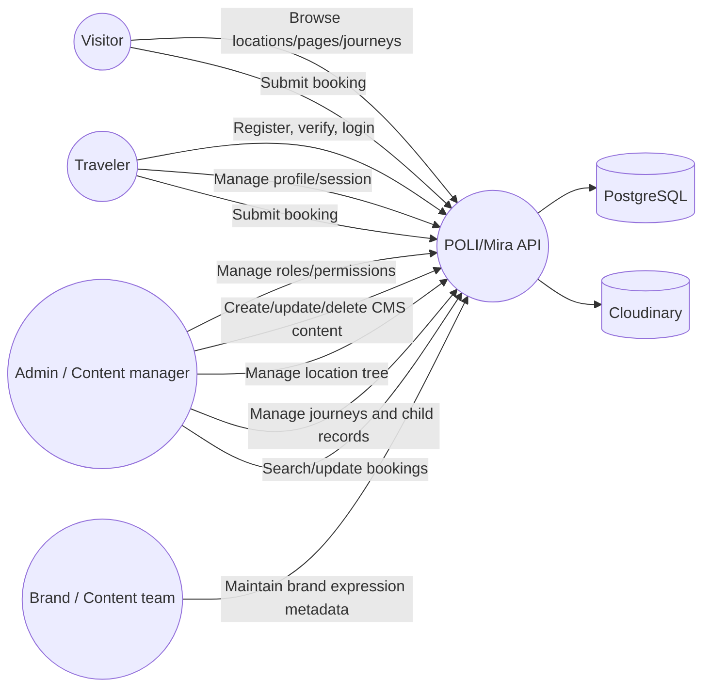

# POLI/Mira Travel Server — SDLC, Architecture, Workflow and Project Plan

This document describes how the POLI/Mira Travel backend should be understood, planned, developed, tested, deployed, and maintained. It is written for developers, project managers, frontend teams, QA engineers, and AI coding agents.

## 1. Product scope

POLI/Mira is a travel-content and journey-booking platform. The backend provides:

- Travel destination/location hierarchy.
- Generic CMS pages and sections.
- Country, region, and place content pages.
- Journey catalog and discovery filters.
- Journey locations, itinerary days, accommodations, and add-ons.
- Authenticated booking requests with a rule-driven, configurable deposit/full-payment/installment engine, and protected booking administration.
- Authentication, sessions, roles, permissions, and audit logging.
- Cloudinary media storage, Redis caching, Swagger documentation, and Socket.IO support.

The central product relationship is:

```text
Location tree -> destination pages -> Journey -> itinerary/accommodation/add-on -> Booking
```

## 2. System architecture

```text
                         +----------------------+
                         |  Web / Mobile Client |
                         +----------+-----------+
                                    |
                         HTTPS REST / Socket.IO
                                    |
+----------------------------------------------------------------+
|                       Express application                      |
|                                                                |
|  Security -> Rate limit -> Auth/RBAC -> Validation -> Routes   |
|                                                   |            |
|                              +--------------------+            |
|                              | Controllers                      |
|                              +--------------------+            |
|                                                   |            |
|                              +--------------------+            |
|                              | Domain services                  |
|                              +--------------------+            |
|                                                   |            |
|                    +------------------------------+            |
|                    | Shared CRUD / cache / upload / audit      |
|                    +------------------------------+            |
+-------------------------+----------------------+---------------+
                          |                      |
                 +--------v--------+     +-------v-------+
                 | Prisma/Postgres |     | Redis (opt.)  |
                 +--------+--------+     +---------------+
                          |
                 +--------v--------+
                 | Cloudinary     |
                 +-----------------+
```

### Architectural layers

| Layer           | Implementation                | Responsibility                                           |
| --------------- | ----------------------------- | -------------------------------------------------------- |
| Entry point     | `index.ts`                    | Connect dependencies, listen, graceful shutdown          |
| Application     | `app.ts`                      | Express, security middleware, health, Socket.IO, Swagger |
| Bootstrap       | `bootstraps.ts`               | Mount every module router under `/api/v1`                |
| Routes          | `src/modules/**/**.routes.ts` | Method/path and middleware order                         |
| Validation      | `*.validator.ts`              | Zod input contract and create requirements               |
| Controller      | `*.controller.ts`             | Thin HTTP adapter                                        |
| Service         | `*.service.ts`                | Domain business rules and Prisma query composition       |
| Shared services | `src/shared/`                 | Generic reads, writes, deletion, media, cache            |
| Persistence     | `prisma/schema/`              | Models, relations, enum values, migrations               |

## 3. Runtime request workflow

```text
Client request
  -> Helmet/CORS/HPP/XSS/compression
  -> body parser/cookie parser/rate limiter
  -> router matching
  -> protect (if private)
  -> accessMiddleware (permission and scope)
  -> uploadFile (if multipart)
  -> validate (Zod)
  -> controller
  -> domain service
  -> Prisma / Redis / Cloudinary
  -> successResponse
  -> response logger
```

Errors travel to the central error middleware. Services should throw `ApiError` with an appropriate HTTP status instead of writing responses directly.

## 4. Use-case diagram



## 5. Main use cases

### Traveler

1. Browse published destination content.
2. Filter journeys by type, style, personality, pace, comfort, price, duration, or location.
3. Open journey details with locations, itinerary, stays, and add-ons.
4. Submit a booking request while logged in (no payment taken at this step; see Booking & payment flow).
5. Register, verify email, log in, refresh session, update profile, and reset password.

### Admin/content manager

1. Create and maintain Location hierarchy.
2. Create CMS pages and ordered sections.
3. Create Country/Region/Place pages tied to correctly typed Locations.
4. Create and publish Journeys.
5. Attach root locations to a Journey.
6. Add itinerary days, accommodations, and location-specific add-ons.
7. Search and manage Booking records.
8. Upload/remove Cloudinary media.
9. Manage roles and permissions.

### Brand/content workflow

Mira brand metadata belongs in flexible `metadata`/`data` JSON. Examples are Country Stamp, accent color, editorial tint, Mira Note, Mira Recommends, Approved by Mira, and Mira Difference. The backend stores and returns this content; visual rendering remains a frontend concern.

## 6. Domain data flow

### Location and page flow

```text
Create Location
  -> choose type and optional parent
  -> create the matching page type
  -> add ordered page sections
  -> frontend reads page + location + sections
```

Rules:

- CountryPage requires a `COUNTRY` Location.
- RegionPage requires a `REGION` Location.
- PlacePage requires a `PLACE` Location.
- Each typed page has one unique `locationId`.
- A section belongs to one page and uses an ordered `order` value.

### Journey flow

```text
Create Journey
  -> upload required media
  -> attach one or more JourneyLocation roots
  -> add child itinerary/accommodation locations
  -> attach location-specific JourneyAddOns
  -> publish
  -> traveler searches and books
```

Journey child-location rule:

- A JourneyLocation is a geographic root.
- Itinerary and JourneyAddOn `locationId` must be a direct or nested child of a JourneyLocation root.
- The root itself and unrelated locations are rejected.
- The rule is implemented with a recursive PostgreSQL CTE in `journeyLocationScope.service.ts`.

Example: if a Journey root is Gulshan, Gulshan's places are valid; Uttara is invalid.

The admin selector uses the same JourneyLocation API with `includeChildren=true`. It returns configured roots in `data` and selectable descendants in `availableLocations`; no separate location endpoint is required.

### Booking & payment flow

```text
Booking request form (customer logged in)
  -> validate journey, add-ons, traveler fields; agree to terms/privacy/"request only"
  -> create Booking (REQUEST_SUBMITTED, UNPAID) — no payment taken
  -> admin reviews (UNDER_REVIEW), searches by status/name/contact/journey/universal text
  -> admin approves -> payment schedule generated from PaymentConfig + departure date (APPROVED)
       > 60 days out  -> 30% deposit now + 70% due 60 days before departure
       <= 60 days out -> 100% due now
  -> admin sends payment request -> AWAITING_DEPOSIT / AWAITING_FINAL_PAYMENT
  -> payment recorded (manual or PSP) -> item PAID, booking totals recalculated
       -> DEPOSIT_PAID_TENTATIVE (deposit only) -> AWAITING_FINAL_PAYMENT (balance due) -> CONFIRMED (fully paid)
  -> admin may reject/cancel, revise the total, override the schedule, waive an item, or refund a payment
     at any point, each guarded and audit-logged (see 03-domain-logic.md#booking--payment-domain)
```

## 7. API delivery plan

### Public API surface

- `GET /api/v1/locations`
- `GET /api/v1/cms-pages`
- `GET /api/v1/cms-pages-sections`
- `GET /api/v1/country-pages`
- `GET /api/v1/country-pages-sections`
- `GET /api/v1/region-pages`
- `GET /api/v1/region-pages-sections`
- `GET /api/v1/place-pages`
- `GET /api/v1/place-pages-sections`
- `GET /api/v1/journeys`
- `GET /api/v1/journey-locations`
- `GET /api/v1/journey-locations?journeyId=<id>&includeChildren=true` (admin selector: returns `availableLocations`)
- `GET /api/v1/journey-itinerary`
- `GET /api/v1/journey-accommodations`
- `GET /api/v1/addons`
- `GET /api/v1/journey-addons`

### Authenticated customer API surface

- `POST /api/v1/bookings` — logged-in traveler submits a request (`Booking.createdBy` is a required FK to `Auth`, so this is not anonymous); no payment is taken at this step.

### Admin API surface

Admin writes use the same resource prefix with `POST` for create/update and `DELETE` for deletion. Roles and permissions are protected. Booking list/update/delete/approve/reject/cancel/revise-total, and all `/payment-schedules`, `/payment-records`, `/payment-config` routes are protected because they expose or change traveler PII and money.

### Journey search contract

```text
GET /journeys?
  journeyType=PRIVATE_JOURNEY,SMALL_GROUP
  &travelStyle=NATURE,CULTURE_HERITAGE
  &perfectFor=COUPLES
  &pace=BALANCED
  &comfortLevel=BOUTIQUE
  &minPrice=1000&maxPrice=4000
  &minDays=7&maxDays=14
  &locationSlug=albania
  &search=mountain coast
```

### Booking admin search contract

```text
GET /bookings?
  bookingStatus=AWAITING_FINAL_PAYMENT
  &journeyId=<id>
  &travelerName=Rahim
  &travelerEmail=example.com
  &departureFrom=2026-06-01
  &departureTo=2026-06-30
  &dueBefore=2026-06-30
  &search=Rahim Albania
```

Universal booking search checks traveler first/last name, email, phone, booking number, journey title, and journey slug. Every search word must match at least one searchable field. `dueBefore` surfaces bookings with an unpaid schedule item due on or before that date (overdue/upcoming payments dashboard).

## 8. SDLC phases

### Phase 0 — Discovery

Deliverables:

- Product goals and user roles.
- Mira brand/content rules.
- Domain glossary and acceptance criteria.
- Initial use cases and API consumers.

### Phase 1 — Architecture and data design

Deliverables:

- Context/container diagram.
- Prisma ERD and relation rules.
- API naming/versioning convention.
- Security and permission matrix.
- Upload, cache, audit, and failure strategy.

### Phase 2 — Implementation

Recommended order:

1. Configuration, logging, error handling, and database connection.
2. Auth, sessions, roles, and permissions.
3. Location hierarchy.
4. Generic CMS and destination pages.
5. Journey aggregate and child resources.
6. Booking submission and admin search.
7. Media, cache, Swagger, and Socket.IO refinements.

### Phase 3 — Verification

Test layers:

- Unit tests for validators, search builders, and hierarchy rules.
- Service tests using a disposable PostgreSQL database.
- API integration tests with Supertest.
- Authorization tests for allowed/denied scopes.
- Upload and Cloudinary failure tests.
- Contract tests for frontend payload/response shapes.
- Performance checks for paginated search and cache behavior.

### Phase 4 — Release

Release checklist:

1. Review migration and rollback impact.
2. Run `npx prisma validate`.
3. Run `npm run build`.
4. Run migrations with `npx prisma migrate deploy`.
5. Verify health endpoint and logs.
6. Smoke-test auth, public journey browsing, booking, and admin CRUD.
7. Confirm CORS, JWT, database, Redis, email, and Cloudinary environment variables.

### Phase 5 — Operate and improve

Monitor:

- HTTP error rate and latency.
- Database connection/query failures.
- Redis availability and cache hit behavior.
- Cloudinary upload/delete failures.
- Login failures and session reuse detection.
- Booking creation and admin status changes.

## 9. Project planning backlog

### Must-have

- Stable auth and refresh-token behavior.
- Permission matrix for every admin resource.
- Location hierarchy and descendant validation.
- CMS/destination page CRUD.
- Journey CRUD and child-resource integrity.
- Booking search and status management.
- API documentation and frontend Postman collection.
- Automated tests for critical business rules.

### Should-have

- Published-only public Journey filter by default.
- Stronger OpenAPI schemas from Zod.
- Search indexes for large booking/location/journey datasets.
- Admin dashboard metrics: pending bookings, published journeys, content completeness.
- Background media cleanup and retry queues.

### Could-have

- Full-text search engine.
- Payment integration.
- Traveler accounts and booking self-service.
- Reviews, wishlist, notifications, and messaging.
- Multi-language content and currency conversion.

## 10. Definition of done

A feature is complete only when:

- Its Prisma model/migration is correct.
- Its validator rejects invalid input.
- Its service enforces cross-record business rules.
- Its route has correct auth/RBAC middleware.
- Its controller returns the standard response shape.
- Its query is paginated and searchable where required.
- Its uploads/cache/audit behavior is handled.
- Positive and negative tests exist.
- Swagger/Postman and this documentation are updated.
- Build and schema validation pass.

## 11. AI-agent handoff protocol

An AI agent working on this repository should:

1. Read this document and `markdown/README.md`.
2. Confirm the route in `bootstraps.ts` before inventing an endpoint.
3. Read the target route, validator, controller, service, and Prisma model together.
4. Preserve the shared CRUD pattern unless there is a documented reason not to.
5. For relation changes, add a migration and update both sides of the Prisma relation.
6. For hierarchy rules, test one allowed descendant and one unrelated location.
7. Never expose booking PII on public routes.
8. Never commit `.env`, tokens, OTPs, or live Postman credentials.
9. Run schema validation, TypeScript build, and focused tests before handoff.

## 12. Current known constraints

- Update is represented by `POST` with an `id`, not HTTP `PATCH`.
- Journey, itinerary, accommodation, and add-on image arrays are handled through multipart uploads.
- Redis is optional; behavior must remain correct when Redis is unavailable.
- The test command clears/seeds a database and must only target disposable test data.
- Public Journey reads should be reviewed to ensure draft content is not exposed.
